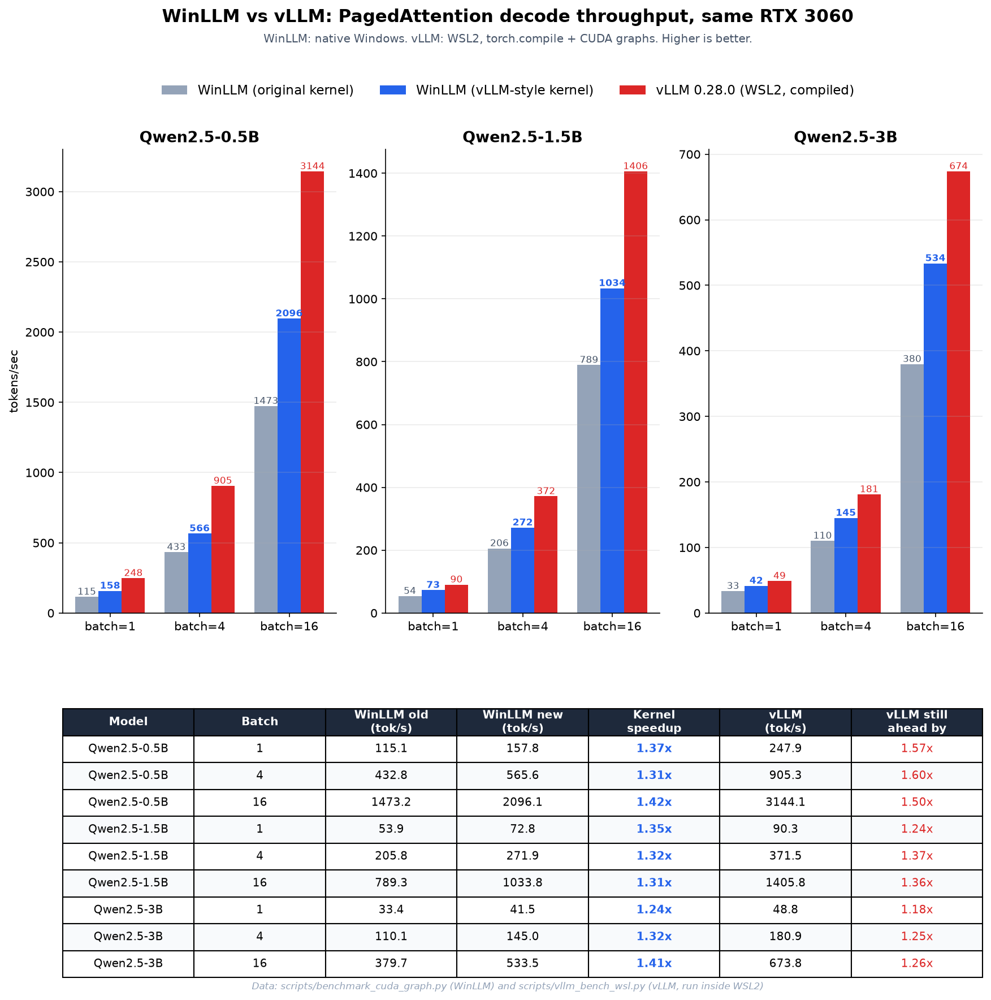

<div align="center">
  

  # wLLM

  **A production-grade LLM inference server, built from scratch, natively for Windows.**

  [](LICENSE)
  [](pyproject.toml)
  [](https://github.com/Sehastrajit-S/wLLM/actions/workflows/ci.yml)
</div>

---

vLLM doesn't run on Windows. wLLM is an independent reimplementation of vLLM's core ideas (PagedAttention, continuous batching, CUDA graphs) as a native CUDA/C++ + PyTorch inference engine that runs directly on Windows, no WSL2 or Docker required, with an OpenAI-compatible API on top.

Single GPU, single machine, NVIDIA CUDA only. Everything below was built and benchmarked on an RTX 3060.

## Why this exists

If you have a Windows machine with an NVIDIA GPU and want a real inference server (continuous batching, paged KV cache, CUDA graphs, quantization, guided decoding), your options have been "install WSL2 and hope it all works" or "don't." wLLM is the other option: a from-scratch engine that targets Windows as a first-class platform, with the same production concerns (auth, rate limiting, structured logging, Windows Service packaging) as any real deployment target.

## Features

**Core engine**
- Custom CUDA PagedAttention kernel (block-based KV cache, no wasted memory from over-allocation)
- Continuous batching scheduler with admission control
- CUDA graph capture for decode (3-7x throughput over the eager path)
- Automatic prefix caching (shared system prompts / multi-turn history reused, not recomputed)
- Chunked prefill (long prompts don't stall other requests' decode progress)
- CPU-swap preemption (evicted sequences resume exactly where they left off, no lost work)
- GGUF quantization (Q4_0 / Q8_0) with dequant-on-the-fly linear layers

**Serving**
- OpenAI-compatible REST API: `/v1/chat/completions`, `/v1/completions`, `/v1/embeddings`, `/v1/rerank`, `/v1/models`
- Streaming (SSE) and non-streaming responses
- Guided decoding (JSON-schema-constrained generation)
- Tool / function calling (native `<tool_call>` format)
- Speculative decoding (n-gram prompt-lookup drafting, no draft model needed)
- Multi-LoRA hot-swap adapter serving, selected per-request via the `model` field
- Beam search
- Embedding and rerank endpoints

**Production**
- API-key auth and per-client rate limiting (both opt-in)
- Structured JSON logging
- Prometheus metrics (`/metrics`)
- Windows Service packaging (runs as a real background service, not just a terminal process)
- CI (GitHub Actions), lint-clean via `ruff`

## Benchmarks

Measured on an RTX 3060, WinLLM vs. real vLLM 0.28.0 (vLLM run under WSL2, since it has no native Windows support at all, so this is the closest possible apples-to-apples comparison on identical hardware):



vLLM is still faster (1.2-1.6x, mostly from its more heavily-optimized attention kernels and `torch.compile` fusion). The gap is a constant-factor, not an order of magnitude, and it's closing. See [`scripts/benchmark_cuda_graph.py`](scripts/benchmark_cuda_graph.py) and [`scripts/make_comparison_chart.py`](scripts/make_comparison_chart.py) to reproduce.

## Requirements

- Windows 10/11
- An NVIDIA GPU (compute capability 7.0+; developed and tested on an RTX 3060)
- [CUDA Toolkit](https://developer.nvidia.com/cuda-downloads) (matching your installed driver)
- Visual Studio 2022 (or Build Tools) with the "Desktop development with C++" workload, for MSVC
- Python 3.11 or 3.12

You don't need to manually configure `PATH`/`CUDA_HOME`/`vcvarsall.bat`. wLLM locates MSVC and CUDA automatically the first time it needs to build its kernel (see [`src/wllm/kernels/_msvc_env.py`](src/wllm/kernels/_msvc_env.py)).

## Installation

```bash
git clone https://github.com/Sehastrajit-S/wLLM.git
cd wLLM
pip install -e .
```

The first request that triggers a decode step will JIT-compile the CUDA kernel (via `torch.utils.cpp_extension`). This takes about a minute, once, and is cached afterward.

## Quickstart

```bash
wllm-server --model Qwen/Qwen2.5-0.5B-Instruct --cuda-graphs --prefix-caching
```

Then talk to it like any OpenAI-compatible endpoint:

```bash
curl http://localhost:8000/v1/chat/completions \
  -H "Content-Type: application/json" \
  -d '{
    "model": "Qwen/Qwen2.5-0.5B-Instruct",
    "messages": [{"role": "user", "content": "What is the capital of France?"}],
    "max_tokens": 32
  }'
```

```python
from openai import OpenAI

client = OpenAI(base_url="http://localhost:8000/v1", api_key="not-needed")
resp = client.chat.completions.create(
    model="Qwen/Qwen2.5-0.5B-Instruct",
    messages=[{"role": "user", "content": "What is the capital of France?"}],
)
print(resp.choices[0].message.content)
```

Run `wllm-server --help` for the full flag list (CUDA graphs, prefix caching, chunked prefill, CPU swap, speculative decoding, LoRA adapters, auth, rate limiting).

## What's not (yet) here

Being upfront about scope, same as the rest of this README:

- Multi-GPU / multi-node (single GPU, single machine only)
- Multi-modal / vision-language models
- AMD or non-NVIDIA GPUs, DirectML
- The PagedAttention kernel is warp-parallel but not yet using tensor cores or fp16 native arithmetic; see the benchmark numbers above for where that leaves it relative to vLLM

## Development

```bash
pip install -e ".[dev]"
python scripts/check_toolchain.py   # verify MSVC/nvcc/CUDA build toolchain
python scripts/run_tests.py         # full test suite, batched (see its docstring for why)
ruff check src/ tests/ scripts/
```

See [CONTRIBUTING.md](CONTRIBUTING.md).

## License

Apache 2.0, see [LICENSE](LICENSE).
